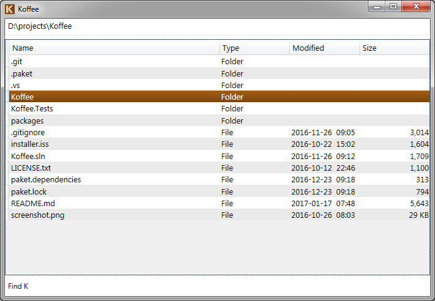

# Koffee
The Keyboard-Oriented File & Folder Explorer for Efficiency, or Koffee, is a no-nonsense alternative to Windows Explorer focused on VIM-style keyboard shortcuts, speed, and simplicity. It is built on .NET WPF, written in F#.

### Why would I want to use this?
**The goal of this application is to allow users to navigate and manipulate files and folders very quickly**, almost at the speed of thought -- a speed only achievable via keyboard. If you've ever experienced the productivity boost that comes from learning and using all the keyboard shortcuts in an application (or learned to use the text editor [VIM](http://www.vim.org/)), you understand what a big difference it makes.

## Installation
Koffee depends on **Microsoft .NET Framework 4.5.1**. It is installed by default on Windows 8.1 or newer. Even on older versions of windows, you may already have it installed; look for it in the list of installed programs in "Programs and Features" (Windows 7 or Vista) or "Add or Remove Programs" (Windows XP). If you don't see it, head to [Microsoft's download page](https://www.microsoft.com/en-us/download/details.aspx?id=40773) to download and install it.

### From [Chocolatey](https://chocolatey.org/)

    choco install koffee

### From [Scoop](https://scoop.sh/)
Koffee is part of the "extras" bucket. If you haven't already, add this bucket with `scoop bucket add extras`.

    scoop install koffee

### From Installer or Zip
Go to the [releases page](https://github.com/mattstermiller/koffee/releases). From there, you can download and run **Koffee-Setup.exe**, which will guide you through the installation with a wizard. Or, if you prefer to install it yourself, you can download the zip file, unzip the app wherever you want and create your own shortcuts.

### From Source
You will need to have installed:
- [Visual Studio or VS Build Tools 2019](https://visualstudio.microsoft.com/downloads/)
  - Make sure to select the components ".NET Core SDK", ".NET Framework 4.5.1 targeting pack" and "F# compiler"

Steps:
- Clone this repository
- Open a terminal to the folder and run `.\fake.cmd build -t install`

## Using Koffee
First of all, take your hand off of the mouse because this is a keyboard tool! Once you're familiar with the hotkeys, you'll be navigating your files more quickly than you ever could with a mouse. If you're familiar with the text editor [VIM](http://www.vim.org/) which is popular among programmers, you should feel at home.

#### The Basics
_A capital letter indicates that the letter key is combined with Shift._
- `j` to move the cursor down
- `k` to move the cursor up
- `h` to go up to the parent folder
- `l` or `Enter` to open the selected file or folder
- `Shift + Enter` to open the "Open With" dialog for the selected file
- `H` to go back in navigation history
- `L` to go forward in navigation history
- `gr` to go to the root directory (Drives)
- `Tab` to switch between the main view and the path box
- `?` to open the Settings window, which displays the hotkeys for all commands.
- `Esc` to cancel actions, searches, path input, etc.
- `Ctrl + w` to exit

#### Advanced Navigation
- **Scroll quickly**
    - `Ctrl + j` and `Ctrl + k` move the cursor by half-pages at a time.
    - `gg` (press `g` twice) jumps to the first item, and `G` jumps to the last item.
- **Find / Jump to item**:
    - Press `f` then the beginning of a file or folder name. The cursor will jump to the first matching item as you type (not case-sensitive).
        - Press `;` during or after a Find to jump to the next matching item.
        - Press `Enter` to open the selected item and close Find.
        - Press `Esc` to close Find.
    - Press `F` to start a "multi" Find, which stays open when opening folders.
- **Search**:
    - Press `/` to start a search. This will move your cursor to a search input at the bottom of the window where you can enter space-separated search terms. The list will be filtered to matching items as you type.
    - Press `Ctrl + i` to toggle whether the search is case-sensitive.
    - Press `Ctrl + r` to toggle regular expression mode instead of term matching.
    - Press `Ctrl + s` to toggle sub-folder searching. A progress bar will show while results are loaded in the background.
    - Press `Up` to go back through previous searches and `Down` to go forward.
    - Press `Shift + Delete` when the previous searches are shown to delete the selected search history
    - Press `Enter` to close the search input and navigate the results. The current search filter will be shown at the bottom of the window.
    - Press `Esc` when the search input is open or when a search filter is active to cancel the search.
    - Press `n` to repeat the previous search when no search is active.
- **Bookmarks**
    - Set a bookmark by pressing `m`. The existing bookmarks are shown. Enter any character to set a bookmark to that character. Upper-case letters are distinct from lower-case letters.
    - Go to a bookmark by pressing `'`. The bookmarks are shown. Enter a character to activate the bookmark set to that character.
    - When viewing bookmarks, press `Delete` then a character to delete the bookmark set to that character.
- **Saved Searches**
    - To save an active search (the search input must be closed), press `m`. The existing saved searches are shown. Enter any character to set a saved search to that character. Upper-case letters are distinct from lower-case letters.
    - Activate a saved search by pressing `` ` ``. The saved searches are shown. Enter a character to activate the saved search set to that character.
    - When viewing saved searches, press `Delete` then a character to delete the saved search set to that character.
- **Sorting**
    - Press `sn` to sort by name, ascending then descending.
    - Press `sm` to sort by modified date, descending then ascending.
    - Press `ss` to sort by size, ascending then descending.
- **Path Box Suggestions** will appear when typing in the path box.
    - When no slashes are in the path box, files and folders that you have opened in Koffee are searched. Items starting with the first search term are shown first, then other matches sorted by most recently visited.
    - When a path is in the path box, everything after the last slash is used to search the folder before the last slash. For example, typing "C:\Windows\sy 32" would suggest "C:\Windows\System32".
    - When suggestions are shown, use the up and down arrow keys to select a suggestion. When there is only one suggestion, it is selected automatically.
    - Press `Tab` to fill in the path box with the selected suggestion and continue typing, or press `Enter` to open the selected suggestion.
    - When suggestions from history are shown, pressing `Delete` will remove it from the list and history.

#### File & Folder Manipulation
- **Selecting**
    - If there is no selection, actions apply to the item under the cursor
    - Press `Space` to toggle whether the item under the cursor is selected
    - Press `Shift + Space` to select or unselect the range of items between the previously toggled item and the cursor, inclusive
    - Press `Ctrl + a` to select all items in the current location
- **Create File or Folder**: Press `o` to create a file or `O` to create a folder. Type in the name of the new item and press `Enter`.
- **Rename**: There are several ways to start renaming the currently selected file or folder.
    - Press `i` to start with the cursor at the beginning of the name
    - Press `a` to start with the cursor at the end of the name, before the extension
    - Press `A` to start with the cursor at the end of the extension
    - Press `c` to start with the name (without extension) selected so that typing will replace the name
    - Press `C` to start with the full name selected
    - When you are done editing the name, press `Enter`
- **Move / Copy / Shortcut**
    1. Press `d` to start a move, `y` to start a copy, or `Y` to start a shortcut of the selected file or folder. The item and operation will be displayed in the lower-right corner of the window.
    2. Navigate to the destination folder and press `p` to move, copy, or create a shortcut of the item there.
        - A copy to the same folder will append "(copy)" to the name.
        - If an item with the same name already exists, you will be prompted to overwrite it. If you choose to overwrite a folder, the contents will be merged (existing files in the destination with the same name will be overwritten, but the others will remain).
    3. You can cancel a move or copy in progress by pressing `Esc`. Performing a Redo (see below) will resume the action.
- **Delete**
    - Press `Delete` to send the currently selected item to the Recycle Bin. If the item cannot be recycled, an error message will be shown instead.
    - Press `Shift + Delete` to delete it permanently. You will be prompted to make sure this is what you want to do; press `y` to proceed with deletion or press `n` to cancel.
    - You can cancel a delete in progress by pressing `Esc`.
- **Undo / Redo Action**
    - Press `u` to undo the last file or folder action (this includes creating, renaming, moving, copying and deleting). The status bar will report the action that was undone. Since deletions cannot be undone, the status bar will simply report the deletion that cannot be undone.
    - Press `U` to redo the last action that was undone. Note that performing any action after an undo will clear the redo list.
    - Press `gu` to display undo / redo history.
    - You can cancel an undo or redo in progress by pressing `Esc`. You can resume the undo or redo by invoking it again.

- **Copy to Clipboard**: Press `Ctrl + c` to copy the selected item to the Windows Clipboard.
    - Paste in Windows Explorer or another app that accepts files to copy the file or folder there.
    - Paste in any text editor or text input to insert the file or folder's path there.

#### Other
- Repeat cursor, navigation and undo/redo commands by pressing numbers before the command. For example, pressing `4H` will go back 4 times.
- Display navigation history for Back/Forward with `gh`
- Display status message history with `gs`
- Open the selected file and exit with `Ctrl + Enter`
- Open the selected file or folder's properties with `Alt + Enter`
- Open a second window for easier file comparison or moves with `Ctrl + n`
- Open Windows Explorer at your current location with `Ctrl + Shift + e`
- Open the commandline tool (configured in the Settings window) at your current location with `Ctrl + Shift + c`
- Open the currently selected file with your text editor (configured in the Settings window) with `Ctrl + Shift + t`
- Show/hide hidden files and folders with `F9`

To see the full list of commands and their key bindings, open the Settings window with `?`.

## Contributing
If you want to contribute to Koffee, thank you! Head to the [issues page](https://github.com/mattstermiller/koffee/issues).
- Did you find a bug or issue in Koffee? Please create a new issue!
- Do you have an idea for a cool new feature? Please create an issue and detail your idea and how it would work!
- Do you want to contribute but not sure where to start? Look for issues that you might be interested in working on.
    The `help wanted` tag is used for issues that are easier for newcomers to pick up. Bonus if the issue is part of the
    next milestone, but that's not necessary!
- Still not sure? [Email me](mailto:miller.mattster@gmail.com) and we can discuss it!

Please read the [Development Guide](DEVGUIDE.md) to get started on Koffee code.

## Future Planned Features
- Configurable hotkeys
- Theme selection and editor
- And more... check out the [issues list](https://github.com/mattstermiller/koffee/issues) and please add your own ideas and contributions!
