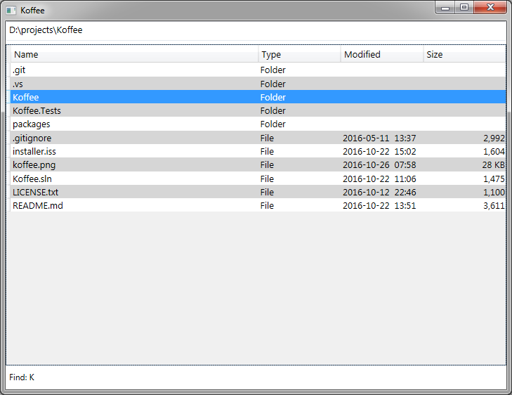

# Koffee
The Keyboard-Oriented File & Folder Explorer for Efficiency, or Koffee, is a no-nonsense alternative to Windows Explorer focused on VIM-style keyboard shortcuts, speed, and simplicity. It is built on .NET WPF, written in F#.

### Why would I want to use this?
**The goal of this application is to allow users to navigate and manipulate files and folders very quickly**, almost at the speed of thought -- a speed only achievable via keyboard. If you've ever experienced the productivity boost that comes from learning and using all the keyboard shortcuts in an application (or learned to use the text editor [VIM](http://www.vim.org/)), you understand what a big difference it makes.

## Installation
Koffee depends on **Microsoft .NET Framework 4.5.1**. You may already have it installed; look for it in the list of installed programs in "Programs and Features" (Windows 10, 8, 7, or Vista) or "Add or Remove Programs" (Windows XP). If you don't see it, head to [Microsoft's download page](https://www.microsoft.com/en-us/download/details.aspx?id=40773) to download and install it.

To install Koffee, go to the [releases page](https://github.com/mattstermiller/koffee/releases). From there, you can download and run **Koffee-Setup.exe**, which will guide you through the installation with a wizard. Or, if you prefer to install it yourself, you can download the zip file, unzip the app wherever you want and create your own shortcuts.

## Using Koffee
First of all, take your hand off of the mouse because this is a keyboard tool! Once you're familiar with the hotkeys, you'll be navigating your files more quickly than you ever could with a mouse. If you're familiar with the text editor [VIM](http://www.vim.org/) which is popular among programmers, you should feel at home.

#### The Basics
_Capitalized letters indicate that the key is combined with Shift._
- `j` to move the cursor down
- `k` to move the cursor up
- `h` to go up to the parent folder
- `l` or `enter` to open the selected folder or file
- `H` to go back in navigation history
- `L` to go forward in navigation history
- `tab` switches between the main view and the path box
- `?` opens the settings window, which displays the hotkeys for all commands. _(This window will allow you to edit the hotkeys and other settings in the future.)_

#### Jumping to Items in the Current Folder
- `Ctrl + j` and `Ctrl + k` move the cursor by half-pages at a time.
- `gg` (press `g` twice) jumps to the first item, and `G` jumps to the last item.
- Press `f` then any character to jump to the next item beginning with that character. _(Note that this is case sensitive, so `a` is not the same as `A`.)_ For example, pressing `fa` will jump to the first file or folder starting with "a". Then press `;` to continue jumping to more items starting with that same character.
- Press `/` to start a search. This will move your cursor to a search box at the bottom of the window. Enter any part of a file or folder name and press `enter` to jump to the next item containing the search term in its name. Then press `n` to go to the next match, or `N` to go to the previous match. The search box accepts regular expressions for powerful searching. _(Don't know what regular expression are? That's OK, just know that some characters like `.`, `*`, `+`, `^`, `$`, `(`, `)`, `[`, `]` have special meaning. Put a `\` in front of these characters to search for them literally.)_

#### File & Folder Manipulation
- **Create File or Folder**: Press `o` to create a file or `O` to create a folder. Type in the name of the new item and press `enter`.
- **Rename**: There are three ways to start renaming the currently selected file or folder.
    - Press `i` to start with the cursor at the beginning of the name
    - Press `a` to start with the cursor between the name and the extension
    - Press `c` to start with the cursor selection around the name (excluding the extension) so that typing will replace the name.
    - When you are done editing the name, press `enter`.
- **Delete**
    - Press `d` to send the currently selected item to the Recycle Bin.
    - Press `D` to delete it permanently. You will be prompted to make sure this is what you want to do; press `y` to proceed with deletion or press any other key to cancel.
- **Undo / Redo Action**
    - Press `u` to undo the last file or folder action (this includes creating, renaming, moving, copying and deleting). The status bar will report the action that was undone. Since deletions cannot be undone, the status bar will simply report the deletion that cannot be undone.
    - Press `U` to redo the last action that was undone. Note that performing any action after an undo will clear the redo list.

#### Other
- Open Windows Explorer at your current location with `ctrl + e`
- Toggle between Windows-style and Unix-style path formats with `F9`

## Version History

#### v0.1.0  Initial Release
- Local file system navigation with VIM hotkeys
- Find by first character and search with regular expression in current folder
- Toggle between Windows and Unix-style path formats

## Planned Features
- File manipulation: create, delete, rename, move, copy, paste files and folders
- Search sub-folders
- Back/forward navigation
- Option to remember previous location
- Configurable hotkeys
- Bookmarks: quickly save and jump to a folder and/or item
- Themes
- Batch renames with regular expressions
- Split view
- And more...

